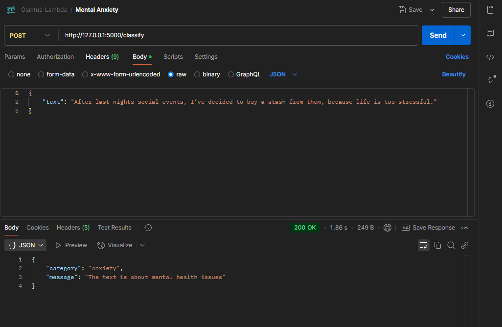
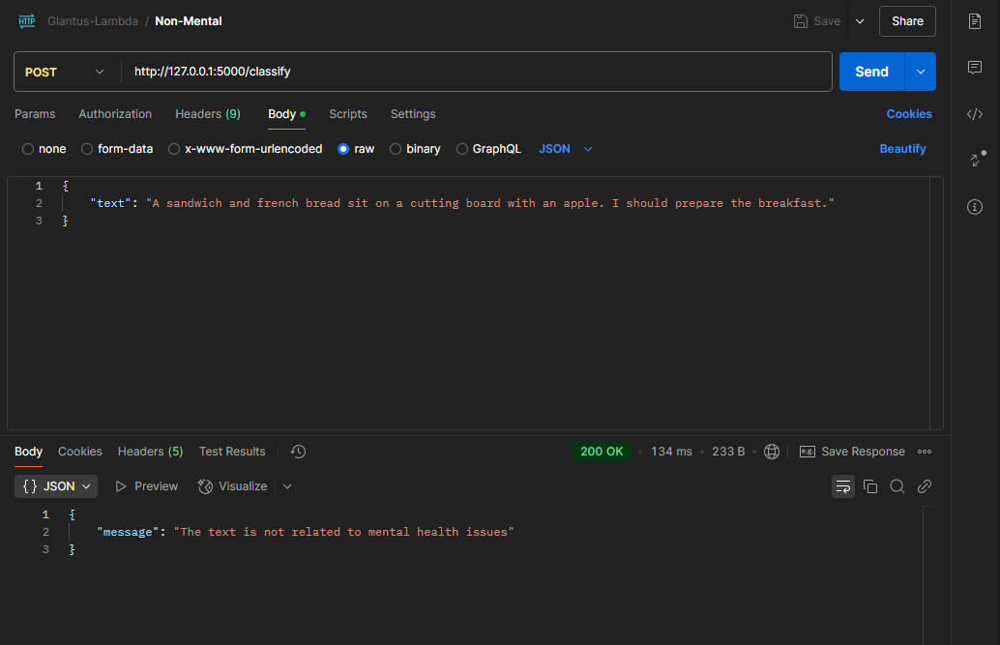

# NLP-Text-Classification

## Description
This is a project for **Foundations of NLP** course in *Artificial Intelligence Master* course of FMI Unibuc. It's supposed to 
cover to follow the topic of Mental Health Detection. I modified this a bit into a Mental Health Text Classifier, which follows 
a 2 layer classifier architecture:
- mental / non-mental issues binary text classifier
- if the above gives a positive for mental health issues -> multiclass text classifier for mental health disorders
For more information, the documentation is attached to the rest of the files.

## The stack:
- Python as the overall PL in Jupyter Notebook
- Pandas, Matplot, Tensorflow, Sklearn, NLTK for data exploration and training
- Flask for a simple HTTP API exposure

## Installation
1. Above the list of files, click <>Code.
2. Copy the desired URL for the repository (HTTPS, SSH), or use Github CLI.
3. Open Git Bash on your machine.
4. Change the current working directory to the location where you want the cloned directory:
    ```bash
        cd <workdir_name>
    ```
5. Type git clone, and then paste the URL you copied earlier:
    ```bash
        git clone <copied_URL>
    ```
6. Install the dependencies and run the React app:
    ```bash
        flask --app 'Mental_Health_Text_Classifier' run
    ```
7. (Optional) If you want, you can run the notebooks as well, but you'll need `Jupyter Server` to host and serve them

## Visuals (Postman)

### Resolution Page


### Davis Putnam Page


## Final Note
Not much to show in terms of visuals of GUI. Majority of the work was don in the backend side.
Documentation was much more interesting if you want to take a look.

This project shows how important planning is. If I started earlier, I could've applied to better datasets and also 
could have planned for a chat app to show a better integration of this API.

## License
This project is licensed under the MIT License. See the LICENSE file for details.

## Contact
Feel free to contact me at: karjhan1999@gmail.com